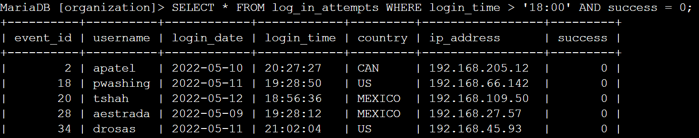
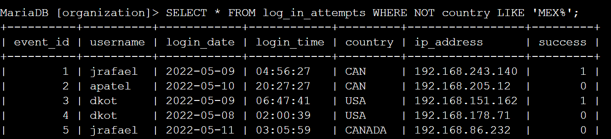
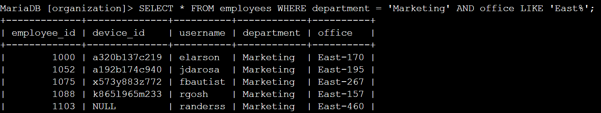
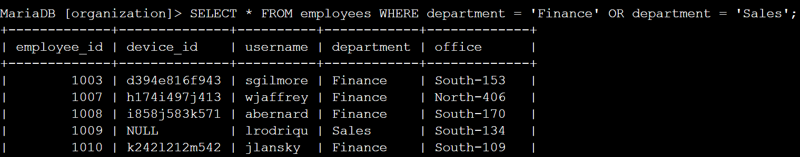
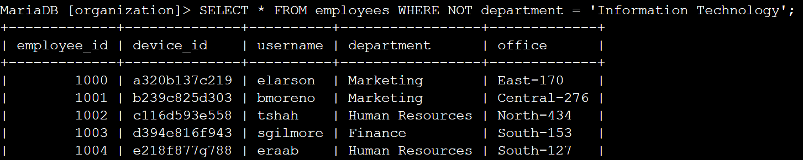

# Apply Filters to SQL Queries

## Project Description

Following the discovery of potential security issues outlined in the [scenario](./docs/Scenario.pdf) involving user login attempts and employee workstations, I was tasked with querying and filtering the organization’s database using SQL to retrieve relevant records across multiple datasets and investigate the security events.

## Database Structure

The investigation involved querying two primary tables within the organizational database: `log_in_attempts` and `employees`.

### Table: `log_in_attempts`
| Column | Description |
|---|---|
| `event_id` | ID assigned to each login event |
| `username` | Username of the employee |
| `login_date` | Date the login attempt was recorded |
| `login_time` | Time the login attempt was recorded |
| `country` | Country where the login attempt occurred |
| `ip_address` | IP address of the employee's machine |
| `success` | Whether the login succeeded (`FALSE`/`0` = failed attempt) |

### Table: `employees`
| Column | Description |
|---|---|
| `employee_id` | ID assigned to each employee |
| `device_id` | ID assigned to each employee's device |
| `username` | Username of the employee |
| `department` | Department the employee belongs to |
| `office` | Office location of the employee |

---

## Retrieve After-Hours Failed Login Attempts

After discovering a potential security incident that had occurred after business hours. All login attempts made after 18:00 were queried in the database for further investigation.

```sql
SELECT * FROM log_in_attempts WHERE login_time > '18:00' AND success = 0;
```


After selecting all columns from log_in_attempts by using an apostrophe `*`, a `WHERE` clause was added to filter and specify the condition of `login_time > ‘18:00’`. An `AND` operator was added to specify another condition, `success = 0`, to show only failed login attempts. The output listed 19 records of failed logins after business hours.

---

## Retrieve Login Attempts on Specific Dates

A suspicious event occurred on 2022-05-09. Logins that happened on that day or the day prior (2022-05-08) were to be investigated.

```sql
SELECT * FROM log_in_attempts WHERE login_date = '2022-05-09' OR login_date = '2022-05-08';
```



Similar to how a query for failed after hours login was made, all columns from the `log_in_attempts` tables were selected. A `WHERE` clause and an `OR` operator was added to filter the result to only show records where `login_date = '2022-05-09'` or `login_date = '2022-05-08'`. After the query, 177 records were outputted by the database.


---

## Retrieve Login Attempts Outside of Mexico

The team has determined that the suspicious login activity did not originate in Mexico, thus all login attempts outside of Mexico were to be investigated.

```sql
SELECT * FROM log_in_attempts WHERE NOT country LIKE 'MEX%';
```



A `WHERE` clause followed by a `NOT` was used to filter the `country` column for countries that are not Mexico. Due to the record’s inconsistency of Mexico being written as `MEX` and `MEXICO`, `LIKE` was used with the `‘MEX%’` pattern instead of `country = ‘Mexico’`, After the query, 144 records of login attempts made outside Mexico were given.

---

## Retrieve Employees in Marketing (East Building)

The team wants to perform security updates on specific employee machines in the Marketing department, specifically in the East building, a query for all employees in the Marketing department was to be made. 

```sql
SELECT * FROM employees WHERE department = 'Marketing' AND office LIKE 'East%';
```



After selecting all columns from the  employees table, a `WHERE` clause along with an `AND` operator was used to specify the two filters of `department = ‘Marketing’` and `office LIKE ‘East%’`. A `LIKE` operator and a `%` wildcard was used due how office numbers vary;  it ensures the query captures all offices located within the East building.

---

## Retrieve Employees in Finance or Sales

For employee machines in the Finance and Sales department, a different security update is required.  

```sql
SELECT * FROM employees WHERE department = 'Finance' OR department = 'Sales';
```




After selecting all columns from the `employees` table, a `WHERE` clause was used, the first condition was `department = ‘Finance’` and the second condition was `department = ‘Sales’`, and `OR` operator was used instead of an `AND` so that the database will display employees in either department, if an `AND` was used, it would only display employees that are in both Finance and Sales department. After the query, the database displayed 71 records of employees.

---

## Retrieve All Employees Not in IT

The team needs to make one additional update to the employees machine, because all machines for employees in the Information Technology department have already had the update, all machines in other departments need to be queried.

```sql
SELECT * FROM employees WHERE NOT department = 'Information Technology';
```



After selecting all columns from the `employees` table, a `WHERE` clause then a `NOT` operator was used to filter for employees not in the Information Technology department. The database shows 161 records of employees whose machine needs to be updated.

---

## Summary

For each task given, queries were made for two tables, `login_attempts` and `employees`. The use of clauses such as `WHERE` and operators such as `NOT`, `OR`, `AND` were used to filter for information. Using the percentage sign `%` wildcard with the `LIKE` operator allowed the query to look for specific patterns in the records.

## Repository Structure & Supporting Files

```text
apply-filters-to-sql-queries/
├── README.md
└── docs/
    ├── Scenario.pdf
    ├── Table_formats.pdf
    └── screenshots/
        ├── Retrieve_after_hours_failed_login_attempts.png
        ├── Retrieve_login_attempts_on_specific_dates.png
        ├── Retrieve_login_attempts_outside_of_Mexico.png
        ├── Retrieve_employees_in_Marketing.png
        ├── Retrieve_employees_in_Finance_or_Sales.png
        └── Retrieve_all_employees_not_in_IT.png
```

- [`docs/Scenario.pdf`](./docs/Scenario.pdf) — Original activity scenario
- [`docs/Table_formats.pdf`](./docs/Table_formats.pdf) — Database schema reference
- [`docs/screenshots/`](./docs/screenshots/) — Query output screenshots
