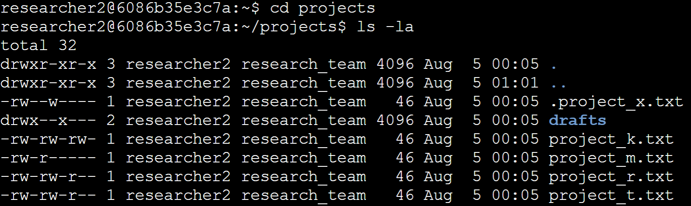
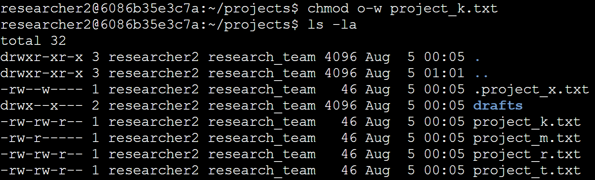
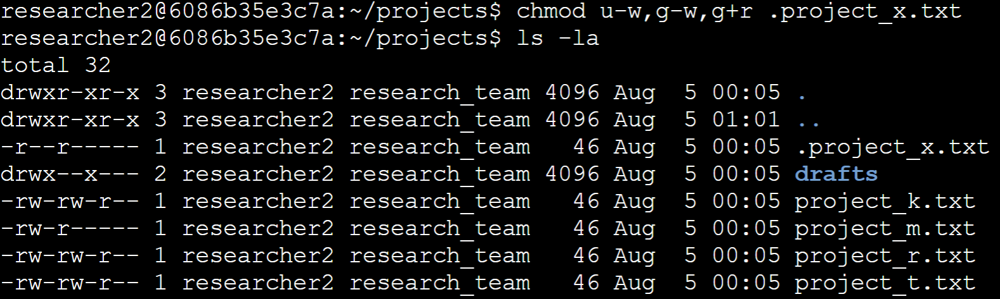
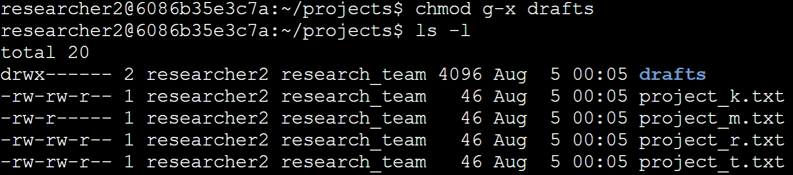

# Use Linux Commands to Manage File Permissions 


## Project Description

Based on the organization's requirements outlined in the [scenario](./docs/Scenario.pdf), files and subdirectories within the research team’s project directory did not reflect the specified authorization levels and required permission updates. The tasks detailed below were performed to remediate these access controls.

## Initial File Permissions

The `/home/researcher2/projects` directory contained the following files and subdirectory prior to any changes:

| File/Directory | User | Group | Other |
|---|---|---|---|
| `project_k.txt` | read, write | read, write | read, write |
| `project_m.txt` | read, write | read | none |
| `project_r.txt` | read, write | read, write | read |
| `project_t.txt` | read, write | read, write | read |
| `.project_x.txt` | read, write | write | none |
| `drafts/` (directory) | read, write, execute | execute | none |

---

## Check file and directory details 

```console
researcher2@6086b35e3c7a:~$ cd projects
researcher2@6086b35e3c7a:~/projects$ ls -la
```


The first command allows access inside the `projects` directory. The second command lists all the files and folders, including hidden ones, within the `projects` directory. The `-l` flag lists the permissions, the `-a` flag shows any hidden files and folders.

---

## Describe the permissions string

* **1st character:** The first character will start with either a character `d` or a hyphen `-`. The character `d` denotes that it’s a directory, while a hyphen `-` denotes that it’s a file
* **2nd - 4th character:** These characters represent the permission of the `user`,  `r` stands for read,  `w` stands for write,  `x` stands for execute. If a user has all permissions, it will be shown as  `rwx`, if the user does not have a specific permission, a hyphen - would take its place, for example, if a user does not have write access, `r-x` would be shown.
* **5th - 7th character:** These characters represent the permission of the `group`. It follows the same rules and format as the user.
* **8th - 10th character:** These characters present the permission of `other`. It follows the same rules and format as the `user` and the `group`.

---

## Change file permissions

The organization did not want `other` to have write access to any files, currently `other` have permission to write on `project_k.txt`

```console
researcher2@6086b35e3c7a:~/projects$ chmod o-w project_k.txt
researcher2@6086b35e3c7a:~/projects$ ls -la
```


The following command was run to remove other’s write permission to that project file. `chmod` is the command to change the access mode for an owner type, `o-w` flag removes the write permission from `other`

---

## Change file permissions on a hidden file

`project_x.txt` is an archived file thus no one should have write permission. However the user and group should be able to read the file.

```console
researcher2@6086b35e3c7a:~/projects$ chmod u-w,g-w,g+r .project_x.txt
researcher2@6086b35e3c7a:~/projects$ ls -la
```


The following command was run, `u-w` removes the user’s write permission and `g-w` removes the group’s write permission. The group did not have read permission so a `g+r` flag was added to correctly give the group its specified permission.

---

## Change directory permissions

It was specified that `researcher2` should be the only user to have access to the `drafts` directory. Currently the `research_team` group has execute access to the directory

```console
researcher2@6086b35e3c7a:~/projects$ chmod g-x drafts
researcher2@6086b35e3c7a:~/projects$ ls -l
```


The following command was run, the  `g-x` flag removed the group’s execute access. `researcher2` already has read, write, and execute permission and others has no permission at all so no changes had to be made for those owners.

---

## Summary

The permission for `other` to write on `project_k.txt` file was removed. Then the archived `project_x.txt` had its permission updated so the `user` and the `group` had no write access, as well as `other` not having read permission. Lastly, `group` execute access was removed from the `drafts` folder so `researcher2` is the only user to have full access to the `drafts` directory.

## Repository Structure & Supporting Files

```text
use-linux-commands-to-manage-file-permissions/
├── README.md
└── docs/
    ├── Current_file_permissions.pdf
    ├── Scenario.pdf
    └── screenshots/
        ├── Check_file_and_directory_details.png
        ├── Change_file_permissions.png
        ├── Change_file_permissions_on_a_hidden_file.png
        └── Change_directory_permissions.png
```

- [`docs/Scenario.pdf`](./docs/Scenario.pdf) — Original activity scenario
- [`docs/Current_file_permissions.pdf`](./docs/Current_file_permissions.pdf) — Baseline permissions reference document
- [`docs/screenshots/`](./docs/screenshots/) — Terminal input and output screenshot

